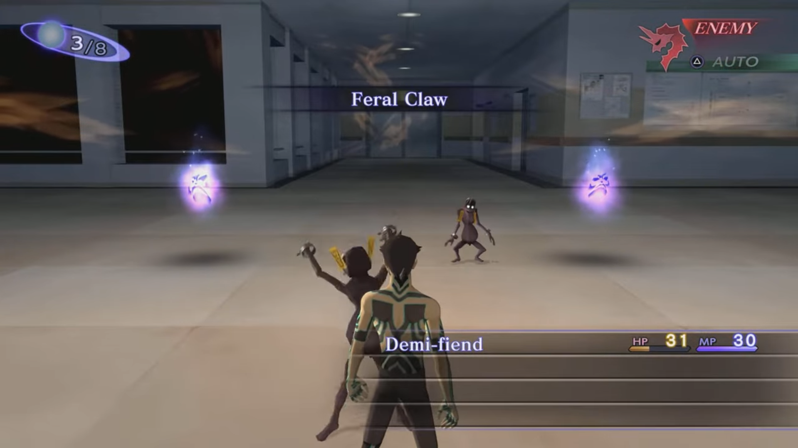
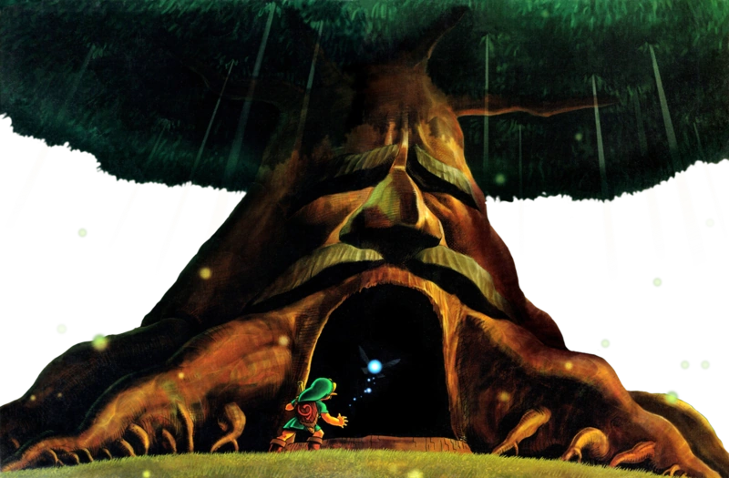
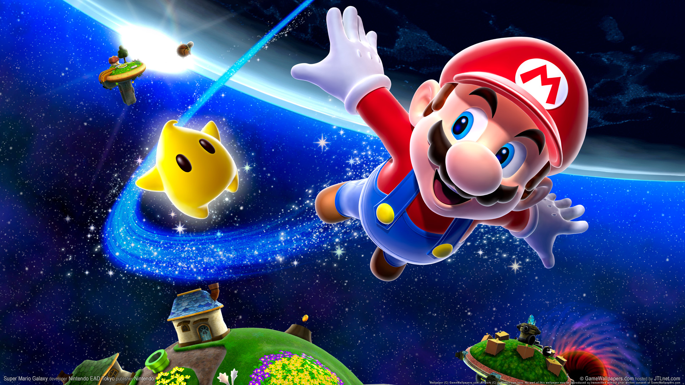

# Leadmotivs-final-project

Proyecto final de la asignatura Informática Musical

## Autores

- Julián Serrano Chacón
- Jiale He

## Descripción

En este proyecto vamos a adaptar un Leadmotiv original a varios estilos y contextos musicales que se pueden dar en un videojuego.  
La idea es acompañar las composiciones musicales con un apoyo visual, ya sea un videojuego o una animación, la música se adaptará al entorno conforme este varíe, ajustándose al contexto actual, así si el personaje se encuentra en una pradera el motivo sonará más tranquila y ambiental que si se encontrase en una mansión encantada donde sonaría todo más tenso y tétrico.  

## Contexto del juego

En este Juego controlarás a un protagonista en un RPG de aventuras en el cual visitarás múltiples mundos y realidades a través de portales, para que cada portal se cree vas a necesitar pelear contra múltiples enemigos e investigar diversos mundos en busca de las piedras que sirven para llegar a nuevas zonas.  
Bajo este contexto tendremos que sonorizar diferentes peleas con música enérgica para las peleas y diferentes estilos musicales para ambientar cada zona de cada mundo visitado.   

## Analisis del Leidmotiv

Hemos decidido darle un carácter animado a la melodía inspirándonos en los motivos de flowey de Undertale, green greens o gourmet race de kirby o melodias para niños como estrellita dónde estás, para ello vamos a compones en una escala mayor una melodía pegadiza y alegre, para ello hemos hecho una melodía que salta constantemente entre notas del acorde con un ritmo rápido y con muchas corcheas y semicorcheas seguidas para darle ese carácter juguetón.  

## Estilos a adaptar

- Combate/tension en distintas intensidades
- Selva tropical
- Espacial
- Bosque

## Características de cada estilo

## Analisis del tema de combate [Jiale He]

  

- En un primer lugar para la composición de música de combate se ha usado como inspiración principalmente el trabajo de composición de juegos RPG de PS2, sobre todo los compuestos por Shoji Meguro para la PS2.
- En estos temas de combate se suelen empezar con un riff repetitivo y simple que se va repitiendo durante el tema entero.
- Estos incluyen una fuerte melodía también a lo largo del tema.
- En estos temas la intensidad aumenta a lo largo de la pieza, lentamente añadiendo nuevos elementos que poco a poco aumentan más y más ese sentimiento de tensión .
- Por ejemplo en el tema de [Last Boss Battle - Before Transformation ](https://www.youtube.com/watch?v=axUVAWoUzTY&list=RDaxUVAWoUzTY&start_radio=1) del Shin Megami Tensei III, se puede observar una intro simple de un riff con un sintentizador en el fondo el cual ya generan una pequeña sensación de tensión el cual lentamente aumenta de intensidad añadiendo más y más instrumentos.
- En cuanto a Instrumentos se puede observar un uso extensivo de sintetizadores muchos de ellos con un sonido bastante simple.
- Por supuesto también esta el uso extensivo de la batería el cual genera sensasiones más pesadas a lo largo del tema.
- En cuanto al producto final, estuve usando bastate tanto SurgeXT como Vital Audio para la parte de sintetizadores. En cuanto a sintetizadores estuve tocando bastante los parametros de esto para obtener un sonido que me interesaba.
- También se ha usado BlueArp para componer un Arpeggio como melodía de sintetizador.
- Otro plugin usado fue sforzando el cual usé para añadirle instrumentos de soundfonts y también en parte como experimento auditivo para ver que texturas se podrían añadirles.
- La escala de la composición es D Armónica Menor y esta a 120 BPM y con un compás de 4/4
- Intenté bastante darle una cierta tensión, como si fuera un encuentro o combate especial, ya sea jefe en un juego RPG muy importante a la historia o un encuentro especial.

## Analisis del tema ambientado en un Selva tropical [Julián Serrano Chacón]

  

- Muchas composiciones ambientadas en selvas tropicales utilizan sonidos graves y reverberantes para transmitir sensación de amplitud, profundidad y densidad espacial. Los registros bajos generan una percepción psicológica de “peso” y distancia, ayudando a representar un entorno grande, húmedo y lleno de vegetación.  
- Para darle una ambientación tropical también es común la presencia de animales selváticos, o elementos como la Cuica que se explican más adelante.  
- Predomina el uso de instrumentos de percusión afinada con sonido de madera, sobre todo el de la Marimba, cuyo timbre apagado y estructura de madera aportan una sonoridad muy característica y propia, además al ser un instrumento cuyo sustain no es muy largo (y no hay forma de alargarlo, ya que a diferencia del vibráfono no cuenta con un pedal) se utiliza mucho una técnica llamada trémolo consistente en un redoble entre una o más notas para alargar su sonido.  
- También hay un instrumento que aporta mucha inmersión llamado Cuica, el cuál también es llamado "Monkey Drum" por su sonido parecido al de un mono, es un instrumento de percusión que se toca haciendo transmitir la vibración al frotar un palo en su interior hacia el parche del exterior, si haces presión sobre el parche puedes hacer que el sonido suene más o menos agudo.  
- Además se pueden ver instrumentos de cuerda frotada tocada con la técnica de Spiccato (no el Pizzicato usado en la música de bosque), consiste en un movimiento de muñeca donde el arco se despega ligeramente de la cuerda entre notas y se usa para pasajes ágiles, virtuosos y con mucha articulación, puede recordar a insectos, lluvia intensa, monos o ramas agitándose.  
- En cuanto a las escalas empleadas, predominan el modo mixolidio (T–T–S–T–T–S–T) o la escala pentatónica menor ((T+S)–T–T–(T+S)–T), Estas escalas evitan la fuerte jerarquía tonal de la armonía funcional tradicional, permitiendo que la música se perciba como un entorno continuo más que como una progresión con resolución clara.  
- Por último, hay presencia del Swing dentro de algunas piezas de bandas sonoras, con su ritmo característico:  

## Analisis del tema ambientado en un Bosque [Julián Serrano Chacón]

  

- A diferencia de la jungla este tipo de música tiene ritmos menos intensos y tienen una mayor tendencia a la fantasía.  
- En cuanto a la elección de instrumentos hay mucha diferencia con respecto a la selva, se suelen utilizar arpas, liras (glockenspiel) o la celesta, instrumento cuyos timbres evocan esa sensación de fantasía característica de muchos bosques en los videojuegos.  
- Las cuerdas frotadas suelen emplear la técnica de Pizzicato (a diferencia de las de jungla que usan Spiccato), consistente en pellizcar las cuerdas con los dedos en lugar de usar el arco, puede recordar a elementos fantásticos, gotas o movimiento suave de hojas.  
- También es posible encontrar flautas, en muchas ocasiones flautas de culturas foráneas como el Shakuhachi japonés o las flautas de pan (se denomina así a múltiples flautas compuestas por tubos, pero hay mucha variedad proveniente de diferentes lugares).  
- Comúnmente se utilizan las escalas en modo Dórico (T–S–T–T–T–S–T) y Mixolidio (T–T–S–T–T–S–T), aunque en alguna ocasión se pueden encontrar en modo Lidio (T–T–T–S–T–T–S) o incluso el eólico (T–S–T–T–S–T–T)(menos frecuentemente), estas escalas aportan un carácter más luminoso y etéreo se utiliza para reforzar sensaciones de magia, misterio o naturaleza idealizada dentro de ciertos entornos boscosos.  

## Analisis del tema de Espacio [Jiale He]

  

- El Espacio como entorno es un lugar poco explorado y mucha de nuestras interpretaciones de esta, están basadas en la ciencia ficción.  
- Mucha música espacial tienen un tono ambiental que intenta simular el inmenso vacío y frialdad del espacio.  
- Se puede observar un uso extenso de sintetizadores en música espacial, resaltando el theremin el cual tiene una asociación cultural con la ciencia ficción (uso en muchas películas antiguas de Ciencia Ficción, el tema de Doctor Who).  
- Para darle sensación de falta de gravedad, de flotar en el vacío del espacio, se puede usar un compás de 3/4 el cual es común en los valses y el cual se usa también en el tema de bajo agua del Super Mario el cual es un vals.  
- Se usa mucho el Modo Lidio en Mario Galaxy por ejemplo el cual es un modo musical que da la sensación de llevarte arriba lo que encaja mucho con la temática espacial.  
- En cuanto a la composición final el tema está en D lidio con un BPM de 70 y un compás de 3/4  
- Todos los instrumentos de esta pieza son Sintetizadores y se ha usado exclusivemente Vital Audio para la composición. He intentado usar tanto presets como instrumentos que me hize yo misma mas instrumentos defaults que he modificado para obtener los sonidos futuristas de un espacio el cual es bastante vacio.
- Tambien intenté darle un toque algo melancólico y ambiental para resaltar el frio y vacio espacial.

## Bibliografía y referencias

- [Ludofonía](https://www.youtube.com/@ludofonia)
- [Vídeo de ludofonía acerca de música de Selva](https://youtu.be/CCfNsBHM3fg?si=8WkSYlgftQy_5iqI)
- [Vídeo acerca de la Cuica](https://www.youtube.com/watch?v=7J2WZGCCpEk)
- [OST DK Country](https://youtu.be/Xqf8jID9TsE?si=FFCSoZ_wdcdafGi-)
- [Orchestal OST DK Country](https://youtu.be/quo97zeRfGI?si=QOtC4yeQSJbq0H0k)
- [Vídeo de ludofonía acerca de música de Bosque](https://youtu.be/6yoxdFDv-uI?si=uhC24JSj1pO2fPmS)
- [Música de bosque de Golden Sun](https://youtu.be/i_6KiUyIoRs?si=x6W78x00kYTYDi82)
- [Minish Woods TLoZ Minish Cap](https://youtu.be/PydqkG0xRZo?si=NjPawazqGgnqMLmq)
- [Bosque Kokiri](https://youtu.be/aQ6Fq-LfDZQ?si=N_xX5IFUbIC3v-HE)
- [Artista LEO ROJAS](https://www.youtube.com/channel/UCzFnloeM9qA1j7fuJ-7iT3g)
- [Información acerca de los golpes de arco para violín](https://estudiarelviolin.wordpress.com/wp-content/uploads/2013/06/golpesde_arco.pdf)
- [Información y referencias acerca de la música ambiental](https://www.musicradar.com/news/brief-history-of-ambient-music?utm_source=chatgpt.com)
- [Shin Megami Tensei III Nocturne Final Boss Before Transformation](https://www.youtube.com/watch?v=axUVAWoUzTY&list=RDaxUVAWoUzTY&start_radio=1)
- [How to sound like Shoji Meguro (PS2)](https://www.youtube.com/watch?v=T8-_gYmq60Q)
- [Last Boss Battle - Before Transformation ](https://www.youtube.com/watch?v=axUVAWoUzTY&list=RDaxUVAWoUzTY&start_radio=1)
- [Why Does Space Level Music Sound COSMIC?](https://www.youtube.com/watch?v=K3HOeHaJQ0M)
- [Video de Ludofonía sobre el espacio](https://www.youtube.com/watch?v=IUEFuRQOc8s&t=74s)

## Plugins Usados

- [Vital](https://vital.audio/#getvital)
- [SurgeXT](https://surge-synthesizer.github.io/)
- [BlueArp](https://omg-instruments.com/wp/?page_id=46)
- [Sforzando](https://www.plogue.com/products/sforzando.html)
- [MTPowerDrumKit2](https://www.powerdrumkit.com/)
- [Numa player](https://www.studiologic-music.com/products/numaplayer/)
- [BBC Symphony Orchestra](https://www.spitfireaudio.com/en-eu/products/bbc-symphony-orchestra-discover)
